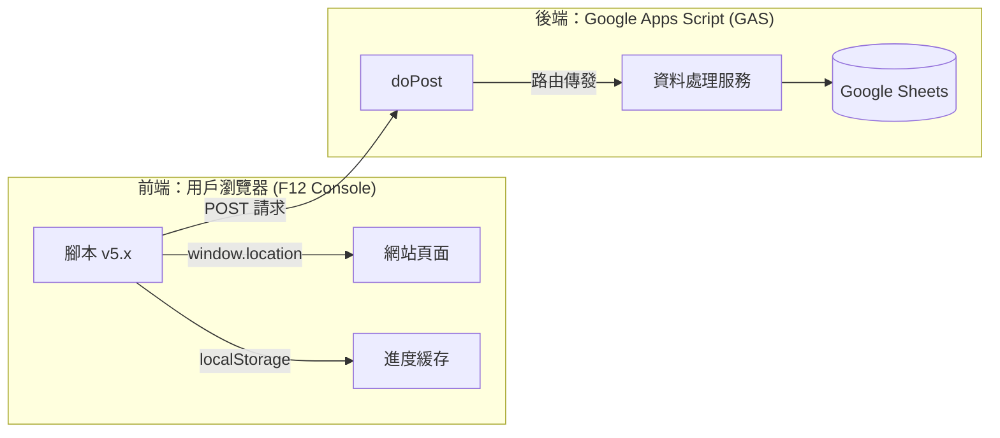

# 🚀 無頭爬蟲替代方案：瀏覽器主控台爬蟲架構指南 (Browser Console Scraper)

## 📌 為什麼使用此方案？
在面對具有「複雜登入認證」、「JavaScript 動態渲染」或「嚴格反爬蟲限制」的網站（如 BEAMS, ZOZOTOWN）時，傳統的後端爬蟲（Puppeteer, Python Scrapy）常因 Session 維效或被封鎖而失敗。

**此方案的核心優勢：**
1.  **複用 Session**：直接使用您在瀏覽器已登入的狀態，無需處理複雜的登入驗證。
2.  **保留篩選器**：保留您在頁面上手動點選的篩選設定（如顏色、件數、排序）。
3.  **規避檢測**：請求來自真實瀏覽器與真實 IP，極難被網站封鎖。

---

## 🏗️ 系統架構圖



---

## 🛠️ 前端腳本模板 (Generic Template)

您可以將此模板修改後用於其他網站：

```javascript
(async function() {
    const CONFIG = {
        WEBHOOK_URL: '您的_GAS_網址',
        STORAGE_KEY: 'my_scraper_state',
        PAGE_DELAY: 2500 
    };

    // 1. 取得狀態與當前頁碼
    const urlParams = new URLSearchParams(window.location.search);
    const currentPage = parseInt(urlParams.get('p')) || 1; // 根據網站參數修改

    // 2. 第一頁強制重置
    if (currentPage === 1) {
        localStorage.removeItem(CONFIG.STORAGE_KEY);
    }

    let state = JSON.parse(localStorage.getItem(CONFIG.STORAGE_KEY) || '{"collectedIds":[]}');

    // 3. 抓取逻辑 (根據目標網站修改選擇器)
    const items = document.querySelectorAll('.product-item'); // 修改選擇器
    const newData = [];
    
    items.forEach(item => {
        const id = item.dataset.id; // 修改 ID 取得方式
        const url = item.querySelector('a').href;
        
        if (id && !state.collectedIds.includes(id)) {
            state.collectedIds.push(id);
            newData.push({ id, url });
        }
    });

    console.log(`📄 頁面: ${currentPage} | 新增: ${newData.length}`);

    // 4. 同步至後端
    if (newData.length > 0) {
        await fetch(CONFIG.WEBHOOK_URL, {
            method: 'POST',
            mode: 'no-cors', // 重要：避免跨網域問題
            body: JSON.stringify({
                action: 'myDataAction',
                data: newData
            })
        });
    }

    // 5. 儲存狀態並翻頁
    localStorage.setItem(CONFIG.STORAGE_KEY, JSON.stringify(state));

    const nextBtn = document.querySelector('.pagination .next a'); // 修改下頁按鈕選擇器
    if (nextBtn) {
        console.log('⏳ 準備跳轉...');
        setTimeout(() => window.location.href = nextBtn.href, CONFIG.PAGE_DELAY);
    }
})();
```

---

## ☁️ 後端 GAS 接收端樣板

在 `doPost(e)` 中處理資料：

```javascript
function doPost(e) {
  const data = JSON.parse(e.postData.contents);
  
  // 根據 action 路由
  if (data.action === 'myDataAction') {
    return processData(data.data);
  }
}

function processData(items) {
  const sheet = SpreadsheetApp.getActive().getSheetByName('資料庫');
  // 執行寫入與去重邏輯...
  return ContentService.createTextOutput(JSON.stringify({success: true}));
}
```

---

## ⚠️ 開發注意事項

1.  **`no-cors` 模式**：瀏覽器 Console 發送請求到不同網域會被攔截，必須使用 `mode: 'no-cors'`。這會導致您無法在 Console 看到回傳的內容，但資料確實會到達 GAS。
2.  **翻頁機制**：
    *   **直接導航**：`window.location.href = url`。優點是穩定，缺點是腳本會中斷，需要重新貼上或配合自動化工具。
    *   **點擊翻頁**：`btn.click()`。優點是腳本持續執行，但容易因為資料還沒載入完就抓取而失敗（需搭配 `MutationObserver` 或長延遲）。
3.  **localStorage 限制**：一般為 5MB。若抓取的內容極大（上萬筆），建議每批次傳送後從 `state` 中移除不需要的欄位，只保留 ID。
4.  **延遲設定**：強烈建議設定至少 `2500ms` 的延遲，避免行為太像機器人被網站二次驗證攔截。

---

## 💡 進階技巧：結合 Tampermonkey
如果您想完全自動化 100 頁的抓取：
1. 將腳本包裝成 **Tampermonkey** 插件。
2. 設定 `@match` 為目標網址。
3. 腳本載入後檢查 `localStorage` 的狀態，自動執行下一頁的操作。
