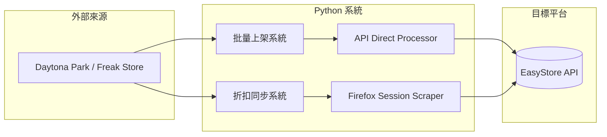

# Active Context

**Last Updated：** 2026-01-13 20:53 (JST)

---

## 🎯 專案狀態

**專案名稱：** TakeMeJapan - Scrapbook Retro E-commerce Platform  
**當前階段：** 🔧 Phase 7 - Admin Backend Content Optimization  
**技術棧：** Next.js 15 + Payload CMS 3.x + MongoDB + Chart.js  
**線上環境：** https://takemejapan.zeabur.app  
**GitHub：** `ms0506029/takeme` (main branch)

---

## ⚠️ 當前任務：Admin 後台內容優化

用戶需求概述：針對後台每個標籤頁的「內容」進行全面優化，涵蓋以下五大區塊：

### 1. 訂單管理 (Order Management)
| 需求 | 說明 | 優先級 |
|------|------|--------|
| **平台轉移** | 從其他電商平台（如 EasyStore）無痛轉移訂單歷史資料 | 高 |
| **遺棄購物車偵測** | 識別已加入購物車但未結帳的顧客 | 高 |
| **結帳提醒** | 手動/自動提醒顧客完成結帳（整合 LINE 推播） | 高 |

### 2. 商品管理 (Product Management)
| 需求 | 說明 | 優先級 |
|------|------|--------|
| **平台轉移** | 從其他平台無痛同步商品資料 | 高 |
| **爬蟲整合** | 與現有 Python 爬蟲系統整合，批量同步商品（含照片） | 高 |
| **折扣同步** | 自動同步來源網站的折扣資訊 | 中 |

### 3. 客戶管理 (Customer Management)
| 需求 | 說明 | 優先級 |
|------|------|--------|
| **平台轉移** | 從其他平台無痛同步客戶資料 | 高 |
| **多元登入** | LINE Login / Google Login / Email 註冊 | 高 |
| **會員制度** | 高度自定義的會員等級系統 | 中 |
| **點數反饋** | 購物點數累積與兌換機制 | 中 |
| **客戶分析** | 客戶淺在深度與行為分析 | 低 |

### 4. 內容管理 (Content Management)
| 需求 | 說明 | 優先級 |
|------|------|--------|
| **圖形化編輯** | 直覺的視覺化頁面編輯器 | 中 |
| **即時預覽** | 前端修改即時預覽 | 中 |

### 5. 網站設定 (Site Settings)
| 需求 | 說明 | 優先級 |
|------|------|--------|
| **字型系統** | 豐富的 Google Fonts 自定義選項 | 低 |
| **顏色系統** | 品牌色彩自定義介面 | 低 |

---

## 📂 關鍵資源索引

| 資源 | 路徑 | 用途 |
|------|------|------|
| 批量上架系統 | `freak store批量上架系統/` | Python 爬蟲 + EasyStore API 整合 |
| 折扣同步系統 | `freakstore折扣同步/` | Python 折扣偵測 + EasyStore API 更新 |
| F12 爬蟲指南 | `利用F12console爬蟲技術指南.md` | 瀏覽器主控台爬蟲架構 |
| UI/UX Workflow | `.agent/workflows/ui-ux-pro-max.md` | 設計系統搜尋工具 |
| Memory Bank | `memory-bank/` | Vibe Coding 記憶庫 |

---

## 🔧 現有系統分析

### 爬蟲系統架構

### 關鍵發現
1. **批量上架系統** (`api_direct_processor.py`)：
   - 使用 `httpx` HTTP/2 高速下載圖片
   - 透過 EasyStore REST API 創建商品
   - 支援 SKU 生成、庫存管理、HTML 描述模板

2. **折扣同步系統** (`sync_freak_discounts.py`)：
   - 使用 Firefox Session 保持登入狀態
   - SKU 映射表 (`sku_variant_mapping.xlsx`)
   - 自動更新所有變體價格

3. **F12 Console 爬蟲**：
   - 適用於複雜登入驗證的網站
   - 使用 `localStorage` 儲存進度
   - 透過 Webhook 同步資料至 GAS

---

## 🚀 下一步

1. **完成 Implementation Plan** 並提交用戶審核
2. 根據用戶反饋調整優先級
3. 開始 Phase 7.1 - 訂單管理優化

---

## 💡 給下一個對話視窗的提示

- 用戶採用 **Vibe Coding** 方法論，所有變更需先更新 Memory Bank
- 現有爬蟲系統以 **EasyStore** 為目標平台，需重構為 **Payload CMS**
- UI 設計需遵循 **UI/UX Pro Max** workflow
- 所有回覆使用 **繁體中文**
