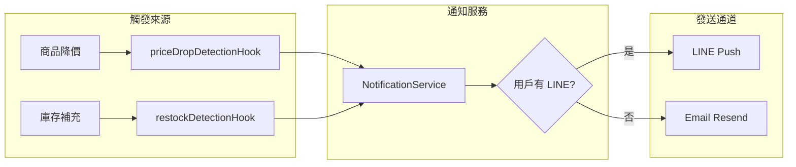
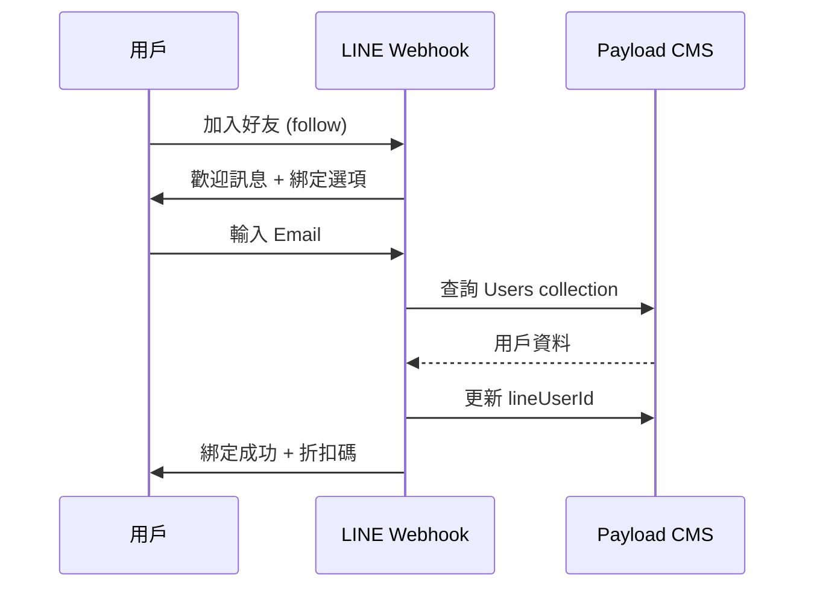

# Active Context

**Last Updated：** 2026-01-15 02:35 (JST)

---

## 🎯 專案狀態

**專案名稱：** TakeMeJapan - Scrapbook Retro E-commerce Platform  
**當前階段：** ✅ Phase 7.5 - LINE Bot Integration + Wishlist System  
**技術棧：** Next.js 15 + Payload CMS 3.x + MongoDB + LINE Messaging API  
**線上環境：** https://takemejapan.zeabur.app  
**GitHub：** `ms0506029/takeme` (main branch)

---

## ✅ 已完成功能（2026-01-15）

### 1. 願望清單 + 補貨通知系統

| 組件 | 路徑 | 功能 |
|------|------|------|
| **Wishlist Collection** | `src/collections/Wishlist.ts` | 用戶收藏商品、降價通知設定 |
| **RestockRequests Collection** | `src/collections/RestockRequests.ts` | 缺貨補貨通知申請 |
| **Price Drop Hook** | `src/hooks/priceDropDetectionHook.ts` | 商品價格監測 → 自動通知 |
| **Restock Hook** | `src/hooks/restockDetectionHook.ts` | 庫存變化監測 → 自動通知 |

### 2. LINE Bot 整合（參考 `line bot優化更新/` 資料夾）

| 組件 | 路徑 | 功能 |
|------|------|------|
| **LineService** | `src/lib/line/line-service.ts` | Push/Reply API、Flex 建構器 |
| **FlexTemplates** | `src/lib/line/flex-templates.ts` | 5 種 Flex Message 模板 |
| **UserStateService** | `src/lib/line/user-state.ts` | 用戶狀態機（避免關鍵字誤觸） |
| **LINE Webhook** | `src/app/api/line/webhook/route.ts` | 處理 follow/message/postback 事件 |

### 3. API 端點

| 端點 | 方法 | 功能 |
|------|------|------|
| `/api/wishlist` | GET/POST/DELETE | 願望清單 CRUD |
| `/api/restock-requests` | GET/POST/DELETE | 補貨申請 CRUD |
| `/api/admin/restock-notify` | POST/GET | 後台手動通知 + 統計 |
| `/api/line/webhook` | POST | LINE 事件處理 |

### 4. Flex Message 模板

| 模板名稱 | 用途 |
|----------|------|
| `priceDrop` | 降價通知（含折扣%、原價/特價） |
| `restock` | 補貨到貨通知 |
| `memberBindingSuccess` | 會員綁定成功 + 折扣碼 |
| `memberBindingFailed` | 綁定失敗 + 重試選項 |
| `outOfStockInteractive` | 缺貨通知 + Postback 按鈕 |

---

## ⚠️ 待設定項目

### 環境變數
```env
# LINE Bot（必填）
LINE_CHANNEL_ACCESS_TOKEN=E01ovFXScGEYxKd+OGsMzB...
LINE_CHANNEL_SECRET=282f9e2b4c7e48a96c3c2428c587a1e9

# Email fallback（選填）
RESEND_API_KEY=...
EMAIL_FROM=notifications@yourdomain.com
```

### LINE Developers Console
- Webhook URL: `https://your-domain.com/api/line/webhook`

---

## 📂 關鍵資源索引

| 資源 | 路徑 | 用途 |
|------|------|------|
| **LINE Bot 參考** | `line bot優化更新/refactored/` | GAS 版本的成功邏輯 |
| **LINE 模組** | `src/lib/line/` | Payload 版本的 LINE 整合 |
| **通知服務** | `src/lib/notifications/` | 通知發送（LINE 優先 + Email fallback） |
| **客戶頁面需求** | `memory-bank/customer-profile-page-requirements.md` | 前端待開發功能清單 |
| 批量上架系統 | `freak store批量上架系統/` | Python 爬蟲 + EasyStore API 整合 |
| 折扣同步系統 | `freakstore折扣同步/` | Python 折扣偵測 + EasyStore API 更新 |
| UI/UX Workflow | `.agent/workflows/ui-ux-pro-max.md` | 設計系統搜尋工具 |

---

## 🔧 系統架構

### LINE 通知流程


### 會員綁定流程


---

## 🚀 下一步（Phase 8）

1. **前端整合**
   - 商品頁愛心 Icon（加入願望清單）
   - 缺貨時「補貨通知」按鈕
   - 顧客個人頁 → 補貨申請履歷

2. **LINE Login 整合**
   - 登入頁 LINE Login 按鈕
   - 自動綁定 LINE User ID

3. **遺棄購物車提醒**
   - 識別未結帳購物車
   - LINE 推播提醒

---

## 💡 給下一個對話視窗的提示

- 用戶採用 **Vibe Coding** 方法論，所有變更需先更新 Memory Bank
- **LINE Bot 整合已完成**，Webhook 在 `/api/line/webhook`
- **願望清單/補貨通知後端已完成**，待前端整合
- 通知發送優先使用 **LINE**，fallback 至 **Email (Resend)**
- 現有爬蟲系統以 **EasyStore** 為目標平台，需重構為 **Payload CMS**
- UI 設計需遵循 **UI/UX Pro Max** workflow
- 所有回覆使用 **繁體中文**

