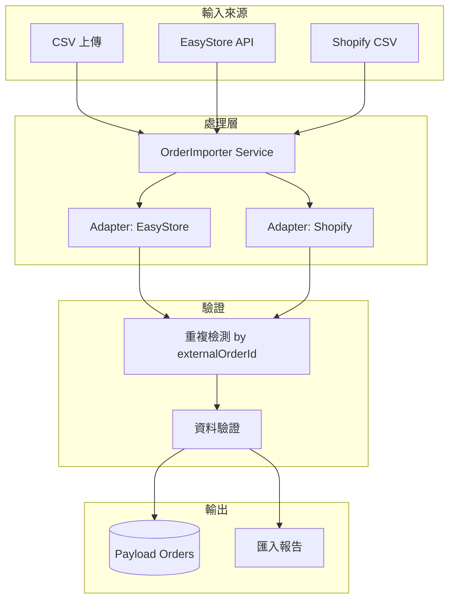

# Phase 7.1.1 Implementation Plan - Order Transfer System

**Created：** 2026-01-13 23:00  
**Status：** ✅ Approved - Ready for Execution  
**Target：** 從 EasyStore / Shopify 等平台匯入歷史訂單至 Payload CMS

---

## ✅ 用戶確認決策

| 項目 | 決策 |
|------|------|
| **匯入格式** | 支援 **CSV** 和 **Excel** 兩種格式 |
| **重複處理** | 遇到重複訂單時 **更新** 現有資料 |
| **客戶關聯** | 暫不處理，保留 `externalCustomerEmail` 欄位供後續對接 |
| **商品關聯** | 暫不處理，保留 `externalProductSku` 欄位供後續對接 |

**設計原則**：訂單先匯入，客戶/商品後續匯入後可執行「對接程序」批量關聯。

---

## 📋 功能概述

建立通用的訂單匯入機制，支援：
1. **CSV 檔案上傳** - 標準逗號分隔格式
2. **Excel 檔案上傳** - .xlsx 格式
3. **欄位映射預覽** - 顯示前幾筆資料確認

---

## 🏗️ Proposed Changes

### Component 1: Core Import Service

#### [NEW] `src/lib/import/order-importer.ts`

核心匯入邏輯，負責：
- 資料驗證
- 欄位映射
- 重複訂單檢測
- 批量寫入 Payload

```typescript
interface ImportResult {
  success: boolean
  imported: number
  skipped: number  // 重複訂單
  errors: { row: number; message: string }[]
}

async function importOrders(data: any[], adapter: OrderAdapter): Promise<ImportResult>
```

---

#### [NEW] `src/lib/import/adapters/easystore-adapter.ts`

EasyStore 欄位映射：

| EasyStore 欄位 | Payload 欄位 | 說明 |
|---------------|-------------|------|
| `id` | `externalOrderId` | 原始訂單編號 |
| `order_number` | `orderNumber` | 訂單顯示編號 |
| `email` | → 查找 users | 關聯客戶 |
| `total_price` | `amount` | 訂單金額（轉分） |
| `currency` | `currency` | 幣別 |
| `financial_status` | → 建立 transaction | 付款狀態 |
| `fulfillment_status` | `status` | 出貨狀態 |
| `shipping_address` | `shippingAddress` | 收件地址 |
| `line_items` | `items` | 訂單商品 |
| `created_at` | `createdAt` | 建立時間 |

---

#### [NEW] `src/lib/import/adapters/shopify-adapter.ts`

Shopify CSV 欄位映射（標準匯出格式）。

---

#### [NEW] `src/lib/import/adapters/easystore-api.ts`

直接從 EasyStore API 拉取訂單：

```typescript
async function fetchOrdersFromEasyStore(
  startDate?: Date,
  endDate?: Date,
  limit?: number
): Promise<EasyStoreOrder[]>
```

使用現有 config:
- API Base: `https://takemejapan.easy.co/api/3.0`
- Token: `EasyStore-Access-Token: f232b671...`

---

### Component 2: Orders Collection Extension

#### [MODIFY] `src/plugins/index.ts`

為 orders collection 新增欄位：

```typescript
{
  name: 'externalOrderId',
  type: 'text',
  label: '外部訂單編號',
  admin: { position: 'sidebar', description: '從外部平台匯入的原始訂單編號' },
  index: true,  // 用於重複檢測
},
{
  name: 'importedFrom',
  type: 'select',
  label: '匯入來源',
  options: [
    { label: 'EasyStore', value: 'easystore' },
    { label: 'Shopify', value: 'shopify' },
    { label: '手動建立', value: 'manual' },
  ],
  defaultValue: 'manual',
  admin: { position: 'sidebar' },
},
{
  name: 'importedAt',
  type: 'date',
  label: '匯入時間',
  admin: { position: 'sidebar' },
}
```

---

### Component 3: Admin UI

#### [NEW] `src/components/Admin/OrderImporter/index.tsx`

匯入介面組件，包含：
1. **來源選擇** - EasyStore API / CSV 上傳
2. **檔案上傳區** - Drag & Drop CSV/Excel
3. **欄位映射預覽** - 顯示前 5 筆資料
4. **匯入進度** - 進度條 + 即時日誌
5. **結果報告** - 成功/失敗統計

#### [NEW] `src/components/Admin/OrderImporter/styles.scss`

樣式檔案（遵循 UI/UX Pro Max 設計）

#### [NEW] `src/app/(payload)/admin/import-orders/page.tsx`

Admin 頁面路由

#### [MODIFY] `src/components/Admin/NavClient.tsx`

新增導航連結：「訂單匯入」

---

### Component 4: API Endpoints

#### [NEW] `src/app/api/import-orders/route.ts`

```typescript
// POST - 匯入訂單（接收 CSV 或觸發 API 拉取）
// 請求: { source: 'easystore-api' | 'csv', file?: FormData, options?: {} }
// 回應: ImportResult
```

#### [NEW] `src/app/api/import-orders/preview/route.ts`

```typescript
// POST - 預覽匯入資料（不實際寫入）
// 回應: { columns: string[], rows: any[], mappingSuggestions: {} }
```

---

## 📊 資料流程圖



---

## ❓ 待用戶確認

> [!IMPORTANT]
> 1. **EasyStore API 直連**：是否希望直接透過 API 拉取訂單？還是只需 CSV 匯入？
> 2. **重複處理策略**：發現重複訂單時，要「跳過」還是「更新」？
> 3. **客戶關聯**：如果 email 在 Payload 中沒有對應用戶，要「自動建立」還是「略過」？
> 4. **商品關聯**：匯入的訂單商品是否需要關聯到 Payload 中的 products？（若無法匹配則用快照）

---

## ✅ Verification Plan

### 自動化測試（Unit Tests）

目前專案沒有發現現有的匯入/adapter 測試。建議新增：

```bash
# 測試 adapter 欄位映射
npm run test -- --testPathPattern=order-importer
```

**新增測試檔案：**
- `src/lib/import/__tests__/easystore-adapter.test.ts`
- `src/lib/import/__tests__/order-importer.test.ts`

### 手動測試步驟

1. **CSV 匯入測試**
   - 準備一個 EasyStore 訂單匯出 CSV（5-10 筆）
   - 進入 `/admin/import-orders`
   - 上傳 CSV 檔案
   - 確認預覽顯示正確欄位映射
   - 點擊「開始匯入」
   - 驗證 `/admin/collections/orders` 中出現新訂單
   - 嘗試重複匯入，確認「跳過」或「更新」行為正確

2. **EasyStore API 拉取測試**（若啟用）
   - 進入 `/admin/import-orders`
   - 選擇「從 EasyStore API 拉取」
   - 設定日期範圍
   - 點擊「拉取訂單」
   - 驗證訂單資料正確寫入

---

## 📁 檔案清單

| 類型 | 路徑 |
|------|------|
| [NEW] | `src/lib/import/order-importer.ts` |
| [NEW] | `src/lib/import/adapters/easystore-adapter.ts` |
| [NEW] | `src/lib/import/adapters/easystore-api.ts` |
| [NEW] | `src/lib/import/adapters/shopify-adapter.ts` |
| [NEW] | `src/components/Admin/OrderImporter/index.tsx` |
| [NEW] | `src/components/Admin/OrderImporter/styles.scss` |
| [NEW] | `src/app/(payload)/admin/import-orders/page.tsx` |
| [NEW] | `src/app/api/import-orders/route.ts` |
| [NEW] | `src/app/api/import-orders/preview/route.ts` |
| [MODIFY] | `src/plugins/index.ts` |
| [MODIFY] | `src/components/Admin/NavClient.tsx` |

---

## 🚀 預估時間

| 項目 | 預估 |
|------|------|
| Core Import Service | 1.5 小時 |
| EasyStore Adapter | 1 小時 |
| Orders Collection Extension | 0.5 小時 |
| Admin UI | 1.5 小時 |
| API Endpoints | 0.5 小時 |
| 測試與驗證 | 1 小時 |
| **總計** | **6 小時** |
