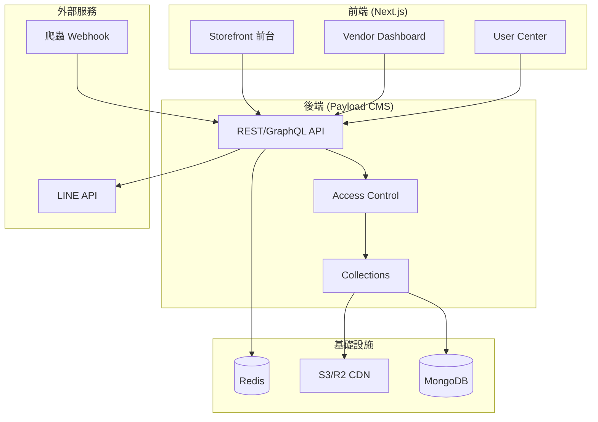

# System Patterns (Architecture)
**Last Updated：** 2026-01-02

---

## 1. 架構概覽



---

## 2. 關鍵設計模式

### 2.1 權限控制 (RBAC)
- **實作方式：** Payload Access Control Functions
- **原則：** 預設拒絕，明確授權

```typescript
// 範例：Vendor 只能存取自己的資料
access: {
  read: ({ req }) => {
    if (req.user?.role === 'vendor') {
      return { vendor: { equals: req.user.id } }
    }
    return true
  }
}
```

### 2.2 庫存鎖定機制
- **技術：** Redis SETNX + TTL
- **流程：**
  1. 下單 → Redis 原子操作預扣庫存
  2. 設定 15 分鐘 TTL
  3. 付款成功 → 正式扣減 MongoDB 庫存
  4. 逾時未付款 → TTL 過期自動釋放

### 2.3 促銷疊加引擎
- **計算順序：**
  1. 會員等級折扣 (百分比)
  2. 活動促銷 (滿額減/滿件折)
  3. 折價券 (最後套用)
- **原則：** 同類型不疊加，不同類型可疊加

### 2.4 Theming 架構
- **核心檔案：** `/src/app/globals.css`
- **變數命名：** 語意化 (--primary, --accent)
- **元件綁定：** shadcn/ui 使用 CSS Variables

---

## 3. 資料夾結構規範

### Collections (Payload)
```
/src/collections/
├── Users.ts          # 用戶 (含角色)
├── Vendors.ts        # 商家
├── Products.ts       # 商品
├── Orders.ts         # 訂單
├── Promotions.ts     # 促銷規則
└── index.ts          # 統一匯出
```

### Components (React)
```
/src/components/
├── ui/               # shadcn/ui 基礎元件
├── layout/           # 佈局元件 (Header, Footer)
├── product/          # 商品相關元件
├── cart/             # 購物車相關
└── dashboard/        # 後台專用元件
```

---

## 4. API 設計原則
1. **RESTful** - Payload 預設 REST API
2. **GraphQL** - 複雜查詢使用 GraphQL
3. **Webhook** - 外部系統整合使用 Webhook endpoint
4. **Rate Limit** - 所有公開 API 透過 Redis 限流

---

## 5. 錯誤處理模式
- **try-catch** - 所有外部 API 呼叫
- **Logging** - 錯誤記錄至資料庫 / 外部服務
- **User Feedback** - 前端顯示友善錯誤訊息
